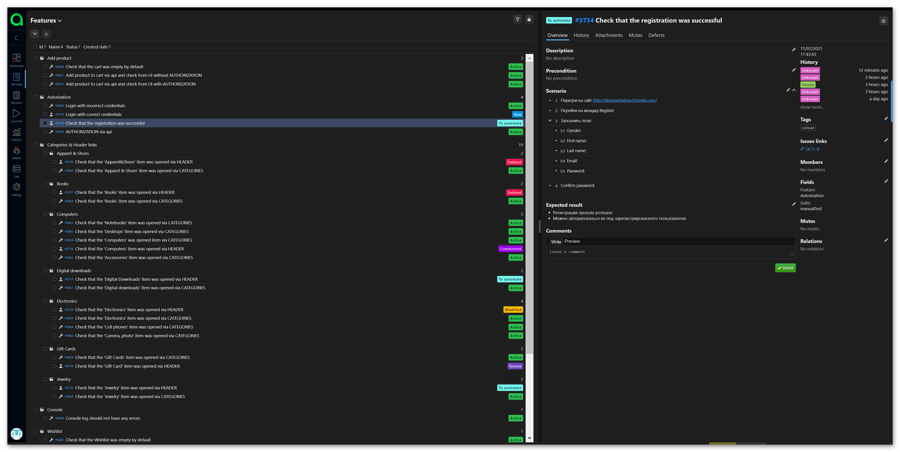
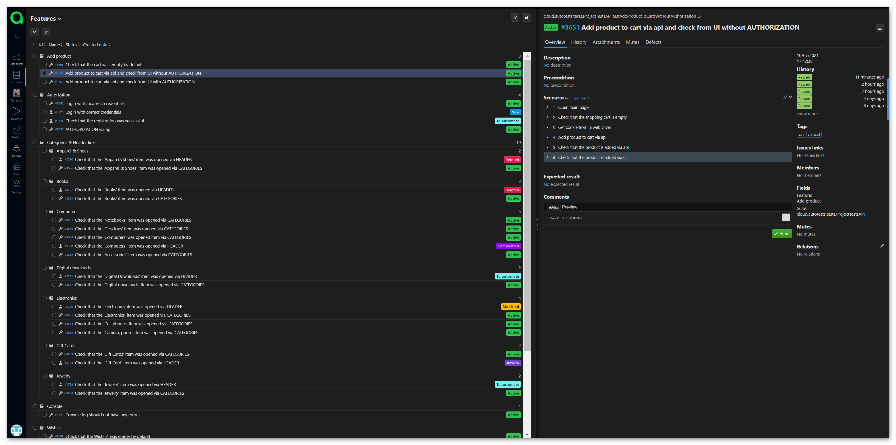

# qa_guru_5_24_katyushin_diploma_demowebshop
# Автотесты на http://demowebshop.tricentis.com


Java, Gradle, JUnit5, Rest-Assured, Selenide, IntelliJ IDEA, Github, Selenoid, Jenkins, Allure Report, Allure TestOps, Jira, Telegram (reports).

## Реализованы проверки:
В реализации использованы разные подходы проектирования, позволяющие достичь разного представления в отчетах
### UI
- [X] - Console log should not have any errors
- [X] - Check that the 'Books' item was opened via CATEGORIES
- [X] - Check that the 'Computers' was opened item via CATEGORIES
- [X] - Check that the 'Electronics' item  was opened via CATEGORIES
- [X] - Check that the 'Apparel & Shoes' item  was opened via CATEGORIES
- [X] - Check that the 'Digital downloads' item was opened via CATEGORIES
- [X] - Check that the 'Jewelry' item  was opened via CATEGORIES
- [X] - Check that the 'Gift Cards' item  was opened via CATEGORIES
- [X] - Check that the 'Desktops' item was opened via CATEGORIES
- [X] - Check that the 'Desktops' item  was opened via CATEGORIES
- [X] - Check that the 'Accessories' item  was opened via CATEGORIES
- [X] - Check that the 'Camera, photo' item was opened via CATEGORIES
- [X] - Check that the 'Cell phones' item was opened via CATEGORIES
- [X] - Login with incorrect credentials
- [X] - Check that the cart was empty by default
- [X] - Check that the Wishlist was empty by default

### API
- [X] - Add product to cart via api and check from UI with AUTHORIZATION
- [X] - Add product to cart via api and check from UI without AUTHORIZATION
- [X] - AUTHORIZATION via api

### Команда для запуска из терминала
Локально должны быть заданы параметры в local.properies, app.properties
```
gradle clean
```
Для запуска в несколько потоков
```
gradle clean -Dthreads=5
```
### Видео о прохождении тестов


### Запуск в Jenkins
https://jenkins.autotests.cloud/job/c05_katyushin_edit_diploma/

Статистика по запускам

Указание параметров для запуска


### Отчёт в Allure Report
https://jenkins.autotests.cloud/job/c05_katyushin_edit_diploma/8/allure/#


### Хранение тест-кейсов в Allure TestOps
https://allure.autotests.cloud/project/262/test-cases?treeId=554 

Ручные и автотесты


Дашборд

Ланчи

Результат запуска ланча


### Интерграция с Jira
https://jira.autotests.cloud/browse/QC5-8

Отображение тест-кейсов и ланча


### Уведомления в Telegram
